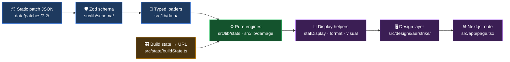
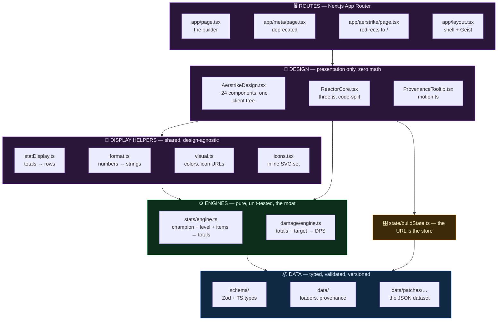
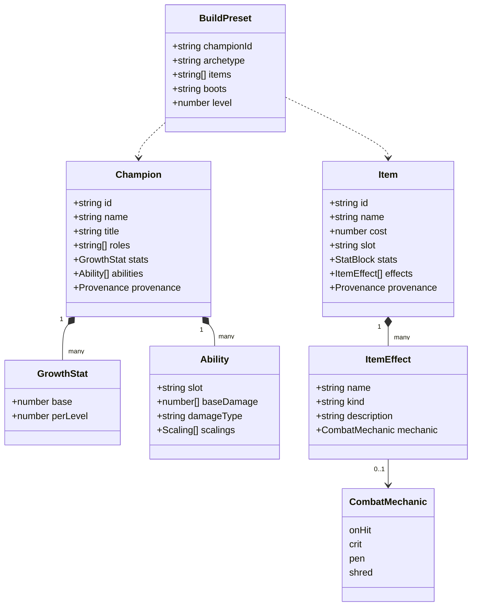
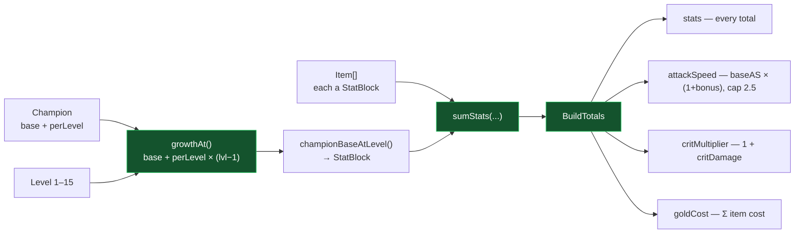
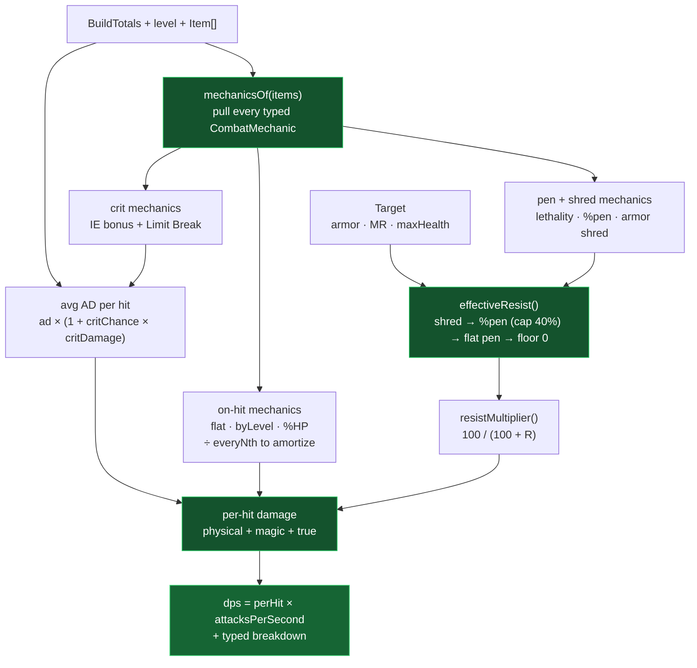
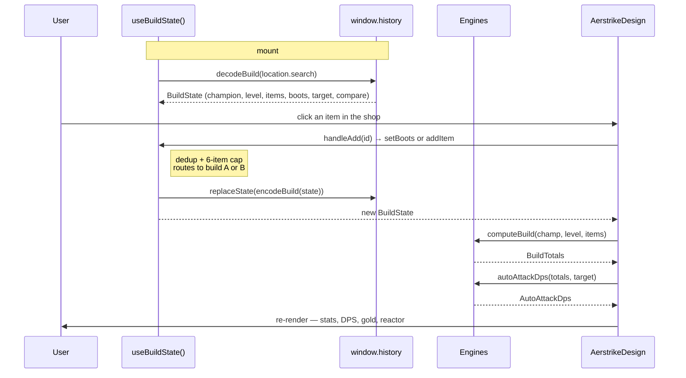
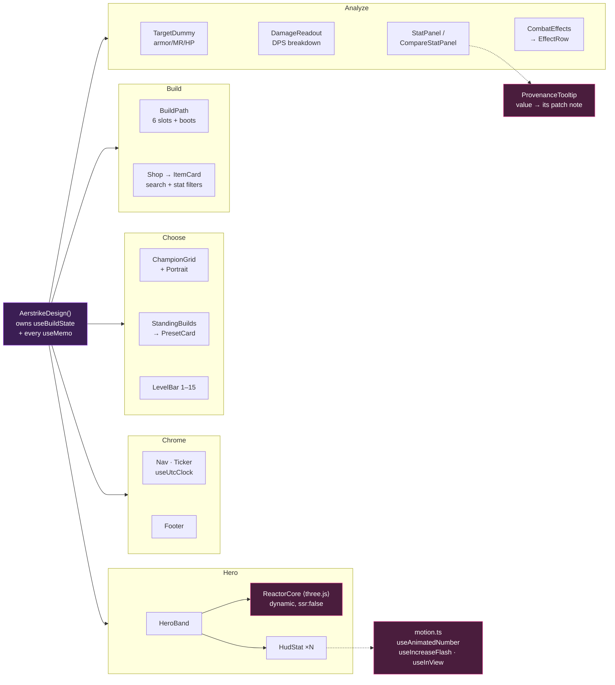
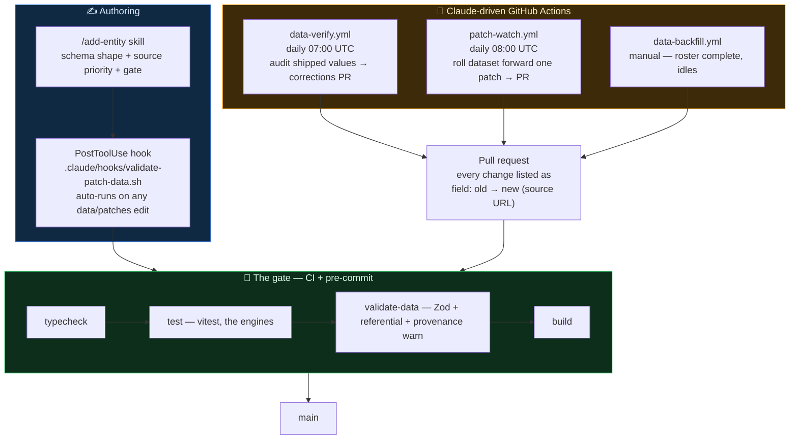

# Architecture — a guided tour of the code

> A walkthrough of Wild Rift Builder from **JSON on disk** to **pixels on screen**.
> Read top-to-bottom the first time; after that, jump to the section you need.
>
> For *what* the product is, see [README.md](./README.md). For *why* it exists and where it's
> going, see [PLAN.md](./PLAN.md). For UI iteration, see [DESIGN_WORKFLOW.md](./DESIGN_WORKFLOW.md).

---

## 1. The one-paragraph version

Wild Rift Builder is a **pure function with a UI bolted on**. Patch data is versioned static
JSON in the repo. At module load, Zod parses it into typed objects. A user's selections
(champion, level, items) live in a single state hook that mirrors itself to the URL. Those
selections feed two **pure, UI-free engines** — stats and damage — whose outputs are formatted
by shared display helpers and rendered by a design layer that owns *zero* math. There is no
backend, no runtime fetch, and no database.



**The one rule that explains every file:** *what a number **is*** lives in `src/lib/` and is
shared; *how a number **looks*** lives in `src/designs/`. Nothing in the design layer computes a
stat, and nothing in `src/lib/` knows what a pixel is.

---

## 2. The layer cake

Each layer only knows about the one beneath it. Arrows point in the direction of dependency.



**Why it's built this way:** the entire value proposition is *accurate + current data*. Keeping
the math in pure functions means it can be unit-tested exhaustively without a browser, and
keeping the data in versioned JSON means every value change is a reviewable `git diff`.

---

## 3. Layer 1 — Data

### 3.1 The schema is the source of truth

`src/lib/schema/` defines every shape in Zod, and the TypeScript types are *inferred from the
schemas* (`z.infer`) — so the validator and the compiler can never disagree.

| File | Defines |
|---|---|
| [`schema/stats.ts`](src/lib/schema/stats.ts) | `STAT_KEYS` — the 22-stat vocabulary — plus `StatBlock`, and `STAT_META` (label, group, flat-vs-percent) |
| [`schema/index.ts`](src/lib/schema/index.ts) | `Champion`, `Item`, `Ability`, `BuildPreset`, `PatchMeta`, `CombatMechanic`, `Provenance` |

The key design decision is `STAT_KEYS`: **one vocabulary for every stat source.** A champion's
base stats, an item's stat line, and a computed total are all `Partial<Record<StatKey, number>>`.
That's what lets the engine sum heterogeneous sources with no special-casing —
`sumStats(base, itemStats)` is the whole implementation.

Two forward-looking pieces are modeled *now* even though the MVP barely reads them, so Phase 3
is additive rather than a rewrite:

- **`AbilitySchema`** — base damage per rank, damage type, and stat scalings, on every champion.
- **`CombatMechanicSchema`** — a deliberately narrow, typed vocabulary for the part of an item
  passive a stat sheet can't express: `onHit` · `crit` · `pen` · `shred`. An effect the engine
  can't model stays descriptive free text and is simply ignored. **9 of 108 items** currently
  carry a machine-readable mechanic.



### 3.2 Patch data on disk

```
data/patches/
├─ registry.json          # every known patch → release date + patch-notes URL
├─ 7.1/                   # frozen snapshot (verified: true)
└─ 7.2/                   # ← currently shipped
   ├─ champions.json      # 140 champions
   ├─ items.json          # 108 items (94 items + 14 boots)
   ├─ builds.json         # curated one-click presets
   └─ meta.json           # patch id, date, source URLs, verified flag
```

> ⚠️ **Never copy a number from PC League / Data Dragon.** Wild Rift base stats, growth, item
> stats, costs, and ability values all differ. Data Dragon is used for **champion portrait art
> only** — the rosters match character-for-character, so the images are correct even though the
> numbers are not.

### 3.3 Loading and provenance

[`src/lib/data/index.ts`](src/lib/data/index.ts) is the single door to the dataset. It imports
the JSON, **parses it through Zod at module load** — so malformed data fails loudly and
immediately rather than producing a subtly wrong stat panel — and builds `Map` indexes for
lookup.

```ts
export const champions: Champion[] = ChampionsFileSchema.parse(championsRaw);
export const items: Item[] = ItemsFileSchema.parse(itemsRaw);
// → getChampion(id) · getItem(id) · getItems(ids) · getBuilds(championId)
```

**Provenance** answers *"which patch did this number last change in?"* Each champion/item can
carry a sparse `provenance` map (`{ "attackDamage": "7.2" }`). It's sparse by design: a new
patch only stamps the values it actually touched, and `provenanceFor()` falls back to
`CURRENT_PATCH`. `getPatchInfo()` resolves that version against `registry.json` to get the real
patch-notes URL — which is what lets **every displayed value link to the patch note that
changed it** via `ProvenanceTooltip`. That's the trust feature, and it's why the stamping rule
is non-negotiable in [CLAUDE.md](./CLAUDE.md).

---

## 4. Layer 2 — The engines (the moat)

Both engines are **pure functions**: no React, no I/O, no globals. That's what makes
`npm test` a meaningful correctness gate.

### 4.1 Stat engine — [`src/lib/stats/engine.ts`](src/lib/stats/engine.ts)



Three subtleties worth knowing before you touch this file:

1. **Growth is isolated in one function.** `growthAt()` implements linear growth. If verified WR
   growth ever turns out to be non-linear, that function is the *only* thing that changes.
2. **Attack speed is not a sum.** Champion base AS (e.g. `0.65`) is multiplied by the *bonus
   ratio* accumulated from levels and items, then capped at `2.5`. `championBaseAtLevel` therefore
   emits AS growth as a bonus ratio starting from 0, not as an absolute.
3. **`goldEfficiency()`** prices an item's raw stats against the `GOLD_VALUES` table and returns
   a ratio; `>1.0` means stat-efficient *before* counting passives. Percent stats are priced per
   `1.0` (i.e. per +100%), which is the classic source of 100× bugs here.

### 4.2 Damage engine — [`src/lib/damage/engine.ts`](src/lib/damage/engine.ts)

This is live, not a stub. It models **sustained auto-attack DPS** against a configurable target.



The modeling assumptions are documented in the source *because accuracy is the point* —
"sustained" averages periodic procs (Kraken's every-3rd-hit) and crit across many attacks rather
than simulating one sequence; on-hit damage does not itself crit; percent-health on-hit is
evaluated against a full-health target; melee values are used where an effect differs by range.

**Order of operations matters and is tested:** shred, then percent pen (capped at 40%), then
flat pen, floored at zero. Getting that sequence wrong is the single easiest way to ship wrong
numbers.

`rawAbilityDamage()` / `mitigatedAbilityDamage()` exist and work for ability damage, but
`bonusAttackDamage` / `bonusHealth` scalings still need base-vs-bonus stat separation — that's
the remaining Phase 3 work.

---

## 5. State — the URL *is* the store

[`src/state/buildState.ts`](src/state/buildState.ts) holds everything the user has chosen, in
one `useBuildState()` hook, and mirrors it to the query string. There is no Redux, no context,
no backend — **copying the address bar shares the build.**



The encoding is deliberately terse so shared links stay short:

| Param | Meaning | | Param | Meaning |
|---|---|---|---|---|
| `c` | champion id | | `i2` / `b2` | build **B** items / boots |
| `lvl` | level 1–15 | | `cmp` | comparison mode on |
| `i` | build **A** items, comma-separated | | `a` | which build the shop targets |
| `b` | build **A** boots | | `t` | target `armor,mr,hp` (omitted when default) |

Notice `itemIds` **and** `itemIdsB`: A/B comparison is first-class in state, and every mutation
(`addItem`, `setBoots`, `clearItems`, `loadBuild`) routes to whichever build is `active`.
Champion and level are shared across A and B by design — you're comparing *builds*, not champions.

---

## 6. Layers 3–5 — Display, design, routes

### 6.1 The display helpers exist to prevent drift

A value must look identical everywhere it appears. So formatting is **not** a component concern:

| Helper | Job | Rule |
|---|---|---|
| [`statDisplay.ts`](src/lib/statDisplay.ts) | `StatBlock` → ordered `StatRow[]` grouped offense/defense/utility | Attack speed is special-cased to show final attacks/sec, not the bonus ratio |
| [`format.ts`](src/lib/format.ts) | `formatStat` (percent vs flat), `formatGold`, `formatPatchDate` | Patch dates parse at UTC noon to dodge timezone off-by-one |
| [`visual.ts`](src/lib/visual.ts) | Monogram initials, deterministic hue from a hash, item-class colors, CDN icon URLs | — |
| [`icons.tsx`](src/lib/icons.tsx) | Inline SVG stat + UI icon set, plus `StatIcon` by `StatKey` | — |

> **Never re-implement formatting in a component.** Stat values come from `statDisplay`, gold
> from `formatGold`. This is the rule that keeps two designs showing the same number the same way.

### 6.2 The design layer

`/` renders [`AerstrikeDesign.tsx`](src/designs/aerstrike/AerstrikeDesign.tsx) — a single
`"use client"` tree of ~24 local components. It imports the engines, calls them inside `useMemo`,
and renders. It computes no stats of its own.

Grouped below by the stage of the user's flow each component serves:



Two details that matter:

- **`ReactorCore` is code-split and client-only** (`dynamic(..., { ssr: false })`) — three.js
  stays out of the initial bundle and off the SSR path.
- **The reactor is a readout, never a source.** Its params (`power`, `physicalShare`, `energy`,
  `spin`, `shards`) are derived *from* engine totals. Data flows one way; the visual never feeds
  back into a number.

### 6.3 Routes

| Route | Renders |
|---|---|
| `/` | `AerstrikeDesign` — the shipped builder |
| `/aerstrike` | `redirect("/")` — keeps old preview/shared links alive |
| `/meta` | `MetaDesign` — **deprecated**, `noindex`, shown behind a deprecation banner |

`app/layout.tsx` is the root shell and self-hosts the Geist font.

---

## 7. How data stays correct

Correctness is the moat, so it's defended in four places rather than one.



**`scripts/validate.ts`** does more than a schema parse. It also checks that every build preset
references items that actually exist and sit in the right slot, and it runs a **provenance
advisory pass**: it diffs each patch against the previous one and warns when a `stats`/`cost`
value changed without a provenance stamp. That check is advisory-only — it's a heuristic, and
failing the build on it would be wrong — but it exists because a patch-7.2 item sweep once
shipped ~25 unstamped changes that needed a one-off reconstruction script to repair.

**Source priority**, always: official Riot WR patch notes → `riftgg.app/items` /
`wildriftfire.com`. Cross-check ≥2 sources per value where possible.

**Tests** (`tests/`, 4 files) cover exactly the things that would silently produce wrong
numbers: growth and AS-cap math, gold efficiency, resist/pen order of operations, crit
averaging, Kraken amortization, IE Limit Break, the 40% pen cap, URL encode/decode round-trips,
the 6-item and dedup rules, and provenance fallback.

---

## 8. Where to start reading

Pick the thread that matches what you're changing:

| I want to… | Start here | Then |
|---|---|---|
| **Understand the math** | [`src/lib/stats/engine.ts`](src/lib/stats/engine.ts) | `tests/engine.test.ts`, then `damage/engine.ts` + `tests/damage.test.ts` |
| **Fix or add a champion/item** | Run the `/add-entity` skill | `data/patches/7.2/*.json`, then `npm run validate-data` |
| **Change what a number means** | [`src/lib/schema/stats.ts`](src/lib/schema/stats.ts) | `stats/engine.ts` → `statDisplay.ts` → the design |
| **Change how the UI looks** | [`DESIGN_WORKFLOW.md`](./DESIGN_WORKFLOW.md) | `src/designs/aerstrike/AerstrikeDesign.tsx` |
| **Touch build/share behavior** | [`src/state/buildState.ts`](src/state/buildState.ts) | `tests/build.test.ts` |
| **Understand the roadmap** | [`PLAN.md`](./PLAN.md) | `ROSTER.md` for data coverage |

### The full tree

```
wildriftbuilder/
├─ data/patches/            📦 versioned static JSON — the dataset
│  ├─ registry.json            patch → date + notes URL
│  ├─ 7.1/                     frozen, verified snapshot
│  └─ 7.2/                     champions · items · builds · meta
├─ src/
│  ├─ lib/                  🧠 SHARED — presentation-agnostic
│  │  ├─ schema/               Zod schemas + inferred types (source of truth)
│  │  ├─ data/                 loaders, selectors, provenance resolution
│  │  ├─ stats/engine.ts       PURE stat engine — the MVP core
│  │  ├─ damage/engine.ts      PURE damage engine — auto-attack DPS
│  │  ├─ statDisplay.ts        totals → ordered display rows
│  │  ├─ format.ts             number/date → string
│  │  ├─ visual.ts             colors, initials, icon URLs
│  │  ├─ icons.tsx             inline SVG icon set
│  │  └─ useShare.ts           copy-build-URL hook
│  ├─ state/buildState.ts   🎛️ build state ↔ URL (shareable builds)
│  ├─ designs/
│  │  ├─ aerstrike/         🎨 the shipped UI (presentation only)
│  │  └─ meta/                 deprecated, reachable at /meta
│  └─ app/                  🌐 Next.js App Router routes + root layout
├─ scripts/
│  ├─ validate.ts              schema + referential + provenance gate
│  ├─ smoke.mjs                fetch every route, assert 200
│  └─ verify-data.mjs          local data-verification helper
├─ tests/                   ✅ engine + state unit tests (correctness = the moat)
└─ .github/workflows/       🤖 ci · data-verify · patch-watch · data-backfill
```

---

## 9. Design rules, restated

These are the invariants. Breaking one is how the project stops being trustworthy.

1. **Engines stay pure and UI-free.** Being *correct* where competitors are wrong is the product.
2. **The schema is the single source of truth.** Types are inferred from it, never hand-written
   alongside it.
3. **`src/lib/` computes; `src/designs/` displays.** No math in components, no pixels in lib.
4. **Wild Rift values ≠ PC League values.** Data Dragon is portrait art only.
5. **Every changed value gets a provenance stamp**, so the UI can always link a number to the
   patch note that changed it.
6. **Build state lives in the URL.** No backend required for Phase 1.
