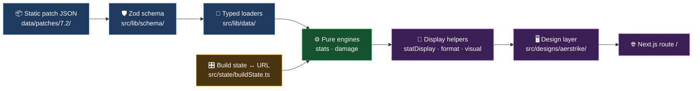

<div align="center">

# ⚔️ Wild Rift Builder

**An accurate, current, interactive stat & build calculator for League of Legends: Wild Rift.**

Think [statcheck.lol](https://statcheck.lol/) for Wild Rift today — growing toward
[lolmath.net](https://lolmath.net/)-style damage modeling as the end state.

<br/>


<br/>

[**Architecture**](./ARCHITECTURE.md) · [**Roadmap**](./PLAN.md) · [**UI workflow**](./DESIGN_WORKFLOW.md) · [**Data coverage**](./ROSTER.md)

</div>

---

## Why this exists

The PC League ecosystem has rich stat tooling. **Wild Rift does not.** What exists today is
either the wrong category or the wrong quality:

| What's out there | Category | The gap |
|---|---|---|
| [wrstat.com](https://wrstat.com/), [rankedwr.com](https://rankedwr.com/), [jungler.gg](https://jungler.gg/wild-rift/) | Win-rate aggregators | Not calculators |
| [wildriftfire.com](https://www.wildriftfire.com/), [wr-meta.com](https://wr-meta.com/) | Static build guides | No interactivity |
| [riftgg.app/items](https://www.riftgg.app/en/items) | Item database | A lookup table, not a builder |
| "Probuilds" mobile apps | Build guides | **Outdated item stats, no stat filtering** |

> ### 🎯 The moat is accuracy + freshness.
> It is precisely what every existing Wild Rift tool fails at — so correctness is treated as the
> highest-priority invariant in this repo, above features and above polish.

---

## What works today

<table>
<tr><td width="50%" valign="top">

### 🧮 Stats
- Champion picker across the **full 140-champion roster**
- Level slider, 1–15 (the WR cap)
- Live totals: champion base + per-level growth + item stats
- Grouped **offense / defense / utility** panel
- Attack speed correctly modeled as base × bonus ratio, capped at 2.5

</td><td width="50%" valign="top">

### 🛒 Shop & builds
- **Search + stat-type filters** (AD/AP/AS/Crit/Armor/MR/HP/Haste) — the feature mobile apps lack
- 6 item slots + a dedicated boots slot
- Running gold cost and per-item **gold efficiency**
- Curated one-click **standing builds** per champion

</td></tr>
<tr><td width="50%" valign="top">

### 💥 Damage
- Sustained **auto-attack DPS** vs a configurable target dummy
- Typed breakdown: physical / magic / true
- Models on-hit passives, crit (incl. IE Limit Break), lethality, %pen (40% cap), and armor shred
- Editable target armor / MR / HP

</td><td width="50%" valign="top">

### 🔗 Trust & sharing
- **A/B build comparison** side by side
- Whole build encoded in the URL — copy the address, share the build
- **Provenance tooltips**: every value links to the patch note it last changed in
- Patch badge signalling whether the data is hand-verified

</td></tr>
</table>

---

## How it fits together



**The rule that explains every file:** *what a number **is*** lives in `src/lib/` and is shared;
*how it **looks*** lives in `src/designs/`. No component computes a stat; nothing in `lib/` knows
what a pixel is.

| Path | Role |
|---|---|
| [`src/lib/schema/`](src/lib/schema/) | Zod schemas + inferred TS types — the single source of truth (already models abilities & item effects) |
| [`data/patches/<patch>/`](data/patches/) | Versioned, hand-verifiable static JSON — champions, items, builds, meta |
| [`src/lib/stats/`](src/lib/stats/) | **Pure stat engine** — champion + level + items → totals |
| [`src/lib/damage/`](src/lib/damage/) | **Pure damage engine** — auto-attack DPS vs a target |
| [`src/lib/data/`](src/lib/data/) | Typed loaders/selectors + provenance resolution |
| `statDisplay.ts` · `format.ts` · `visual.ts` · `icons.tsx` | Shared, design-agnostic presentation helpers |
| [`src/state/buildState.ts`](src/state/buildState.ts) | Build state ↔ URL — shareable builds, no backend |
| [`src/designs/aerstrike/`](src/designs/aerstrike/) | The shipped UI at `/` (presentation only) |
| [`src/app/`](src/app/) | Next.js App Router routes + root layout |
| `scripts/` · `tests/` | Validation + smoke gates, and engine unit tests |

📖 **[ARCHITECTURE.md](./ARCHITECTURE.md) is the full guided tour** — layer diagrams, the stat and
damage pipelines, the state/URL sequence, and a "where to start reading" map.

---

## Quickstart

```bash
npm install
npm run dev
```

Then open **http://localhost:3000**.

| Command | What it does |
|---|---|
| `npm run dev` | Dev server on `:3000` (bound to `0.0.0.0` for the Preview pane) |
| `npm run typecheck` | `tsc --noEmit` |
| `npm test` | Vitest — the pure engines |
| `npm run validate-data` | Schema + referential + provenance check on every patch |
| `npm run build` | Production build |
| `npm run smoke` | Fetch every route, assert 200 (needs `npm run dev` running) |

> **The gate before committing** — also what CI runs (`.github/workflows/ci.yml`):
> ```bash
> npm run typecheck && npm test && npm run validate-data && npm run build
> ```

---

## Data accuracy

> ### 🚫 Wild Rift values ≠ PC League values.
> Never copy a number from PC League or Data Dragon. WR base stats, growth, item stats, costs,
> and ability values all differ. **Data Dragon is used for champion portrait art only** — the
> rosters match character-for-character, so the images are right even though the numbers aren't.

**Source priority when verifying or adding data:**

1. 🥇 Official Riot Wild Rift patch notes — [`wildrift.leagueoflegends.com`](https://wildrift.leagueoflegends.com/en-us/news/)
2. 🥈 In-game / community references — [riftgg.app/items](https://www.riftgg.app/en/items), [wildriftfire.com](https://www.wildriftfire.com/)

Cross-check ≥2 sources per value where possible. Adding or correcting an entity? Use the
**`/add-entity`** skill — it bundles the schema shape, the source-priority rule, and the validate
gate.

### Current dataset status

| Patch | Status |
|---|---|
| **7.2** *(shipped)* | ⚠️ **Not yet fully verified.** 7.2 overhauled the item/boot system and the official WR wiki hadn't published 7.2 numbers as of this writing. Values come from official Riot patch notes cross-checked against wildriftfire / wr-meta. See [`data/patches/7.2/meta.json`](data/patches/7.2/meta.json) and the ROSTER "Patch 7.2" section for exactly what's pending. |
| **7.1** *(frozen)* | ✅ Verified against the official Riot 7.1g patch notes and the official Wild Rift wiki item infoboxes. |

### Item art

Champion portraits are real art from Riot's Data Dragon CDN, with a colored monogram fallback.
**Item tiles use colored monograms** — WR items diverge from PC League and have no canonical
public icon CDN, so real item art waits on a verified Wild Rift asset source rather than showing
wrong League icons.

---

## Automated upkeep

Accuracy and freshness are the moat, so three Claude-driven GitHub Actions defend them. Each
opens a PR listing every change as `field: old -> new (source URL)`.

| Workflow | Trigger | What it does |
|---|---|---|
| **Data Accuracy Verify**<br/>`data-verify.yml` | Daily, 07:00 UTC + manual | Audits every shipped champion/item against verified sources, corrects discrepancies on a branch, opens a PR. Files an issue if a source is unreachable. |
| **Patch Watch**<br/>`patch-watch.yml` | Daily, 08:00 UTC + manual | Rolls the dataset forward one patch per PR toward the newest live WR patch. Skips any patch that already has an open PR. |
| **Roster Backfill**<br/>`data-backfill.yml` | Manual | Adds missing champions/items a batch per run, re-triggering itself until complete. **The roster is complete, so this idles.** Progress in [ROSTER.md](./ROSTER.md). |

Both need an `ANTHROPIC_API_KEY` repo secret; the backfill loop additionally needs a
`WORKFLOW_PAT` (PAT with `repo` + `workflow` scope) to re-dispatch itself across batches.

---

## Roadmap

| Phase | Scope | Status |
|---|---|---|
| **1 — Stat calculator** | Champion + level + items → totals, shop filters, gold efficiency, shareable URLs | ✅ Shipped |
| **2 — Compare & passives** | A/B side-by-side comparison, item passives surfaced, saved builds via Supabase | 🟡 Compare + passives shipped; accounts pending |
| **3 — Damage modeling** | Auto-attack DPS ✅ · ability combos, skill order, EHP, burst windows, runes | 🟡 In progress |
| **4 — Aggregation** | Popular / win-rate builds from a WR stats source | ⚪ Optional, later |

Full detail — competitive landscape, data strategy, open risks — in **[PLAN.md](./PLAN.md)**.

---

## Tech

**Next.js 15** (App Router) · **TypeScript 5.7** · **Tailwind** · **Zod** · **Vitest** ·
**three.js** (the reactor visual) · **Geist**, self-hosted. Deploys on **Vercel**.
Supabase (accounts / saved builds) lands in Phase 2.
